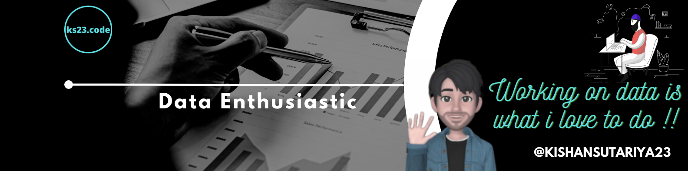

## Hi there, I'm Kishan  

 
 
<h2 align="center"><strong>I'm DATA ENTHUSIASTS from India.</strong><h2>

 
<!-- **I'm DATA ENTHUSIASTS from India & business intelligence consultant at PwC and my passion resonates with my profession too. I enjoy exploring data to get insights and create an impactful story out of it.** -->
 
### :mailbox: Reach me out!

[![Linkedin Badge][linkedinbadge]][linkedin] [][twitter]  [][youtube] [][gmail] 

- 🌱 I’m currently learning everything related to DATA
- 💞️ I’m looking to collaborate with other data nerds
- 🥅 2022 Goals: Do Projects on BIG DATA
- ⚡ Fun fact: i enjoy LEARN UNLEARN RELEARN
- 👨‍💻 All of my projects are available at **[My Portfolio](https://kishansutariya23.github.io)**

 

<h3 align="left">👨🏽‍💻 Languages and Tools:</h3>

 

- ### Fronted: -  
- ### Programming Language: - 
- ### Libraries & Framework: - 
- ### Big Data: -  

- ### ETL Tools: -

- ### Database: -   
- ### CI/CD tools: -    
- ### Visualization tools: - 

 

### :octocat: GitHub Statistics

#### ❤ Views and Followers

|  |  |
| ----------------------------------------------------------------------------------------------------------------------------------------------------------------------------------------------- | ------------------------------------------------------------------------------------------------------------------------------------------------------------------------------------------------ |

Note:</b> Top languages is only a metric of the languages my public code consists of and doesn't reflect experience or skill level.

    

    <strong> :bulb: More stuff about me</strong>

 

I love sharing knowledge and putting posts, blogs and videos together for helping other developers, data analyst  and ....

<!--START_SECTION:waka-->

<!--END_SECTION:waka-->

<!-- Profile Links -->

[linkedin]: https://www.linkedin.com/in/kishankumar-sutariya/
[twitter]: https://twitter.com/ks23_code?t=slipKXB8ZbZG4wDzoTxQ&s=09
[data.world]: https://data.world/dataman-udit
[youtube]: https://www.youtube.com/channel/UCTznaXzOXeFZ8LzWxS0d6_A
[gmail]: mailto:ks23.code@gmail.com
[skype]: skype:------?call

<!-- Shields Profile Links -->

[linkedinbadge]: https://img.shields.io/badge/-kishankumar_sutariya-0e76a8?style=flat&labelColor=0e76a8&logo=linkedin&logoColor=white
[twitterbadge]: https://img.shields.io/badge/-@ks23_code-1ca0f1?style=flat&labelColor=1ca0f1&logo=twitter&logoColor=white&link=https://twitter.com/quantumudit
[gmailbadge]: https://img.shields.io/badge/-ks23.code-c0392b?style=flat&labelColor=c0392b&logo=gmail&logoColor=white
[youtubebadge]: https://img.shields.io/badge/-youtube-e74c3c?style=flat&labelColor=e74c3c&logo=youtube&logoColor=white

<!-- Top Technology Badges -->

[powerbibadge]: https://img.shields.io/badge/-Power%20BI-F2C811?style=for-the-badge&labelColor=212121&logo=powerbi
[tableaubadge]: https://img.shields.io/badge/-Tableau-E97627?style=for-the-badge&labelColor=212121&logo=tableau
[sqlserverbadge]: https://img.shields.io/badge/-SQL%20Server-CC2927?style=for-the-badge&labelColor=212121&logo=Microsoft%20SQL%20Server&logoColor=CC2927
[excelbadge]: https://img.shields.io/badge/-Microsoft%20Excel-217346?style=for-the-badge&labelColor=212121&logo=Microsoft%20Excel&logoColor=217346
[pythonbadge]: https://img.shields.io/badge/-Python-3776AB?style=for-the-badge&labelColor=212121&logo=python

<!-- Tools & Technology Links -->
 
